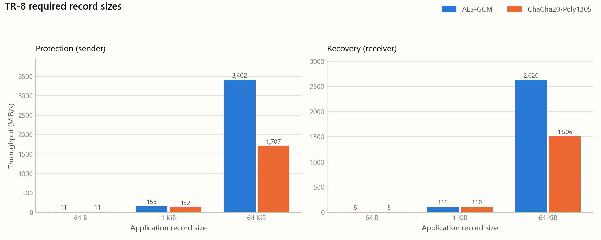
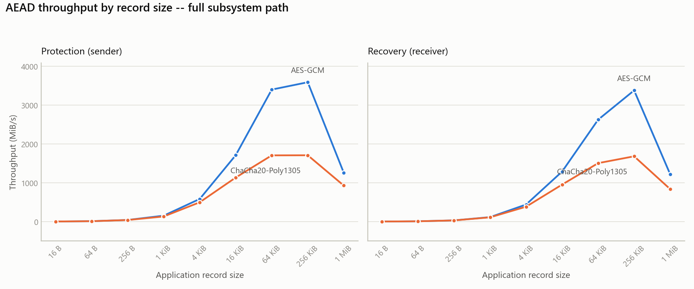
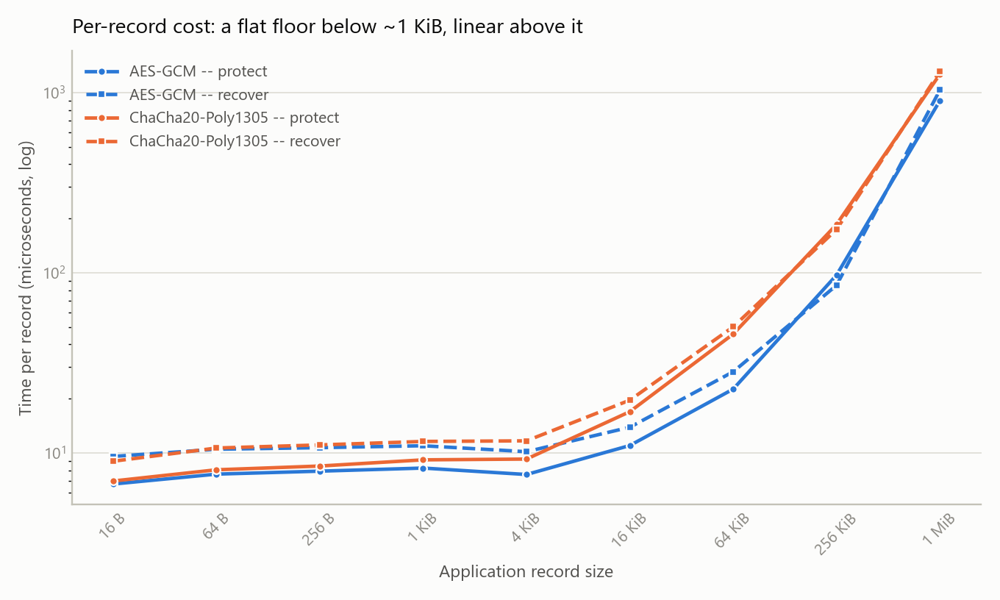
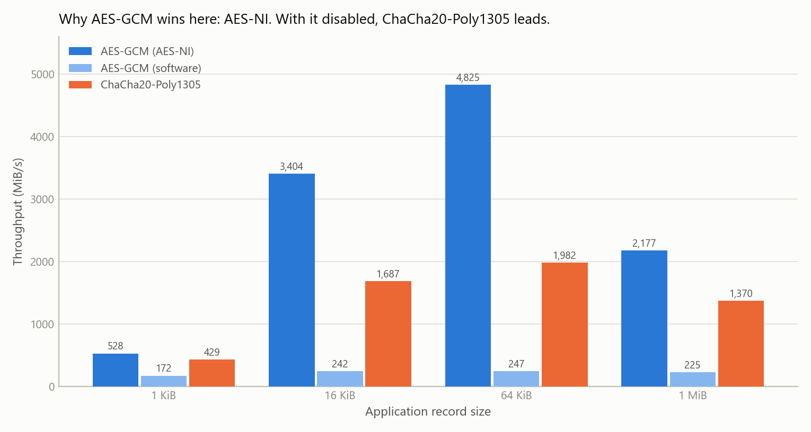

# Assignment 1 Report

## Secure Data Protection using AES-GCM and ChaCha20-Poly1305

**CS6530 — Applied Cryptography** · CSE Department, IIT Madras · Jul–Nov 2026

---

### Contents

1. [Introduction](#1-introduction)
2. [Design Summary](#2-design-summary)
3. [Testing Results (TR-1 – TR-7)](#3-testing-results)
4. [Performance Analysis (TR-8)](#4-performance-analysis-tr-8)
5. [Discussion](#5-discussion)
6. [Supporting Evidence Index](#6-supporting-evidence-index)

---

## 1. Introduction

This report documents a secure data protection subsystem for generic
chunked/packetized application data. The subsystem protects each *application
record* independently using Authenticated Encryption with Associated Data, in
either of two configurations — **AES-256-GCM** or **ChaCha20-Poly1305** — and
recovers it at the receiver only if it is genuine, unmodified and not a replay.

No cryptographic primitive is implemented here. AES, ChaCha20, GCM and Poly1305
are used through `pyca/cryptography` 43.0.3 (OpenSSL 3.3.2), as Section 3.2 of
the assignment directs. The engineering content is everything around those
calls: how records are framed, how nonces are allocated so they can never
repeat, what metadata is bound into the authentication tag, how replays are
detected, and how the receiver behaves when verification fails.

**Headline results.** All eight Testing Requirements pass under both AEAD
configurations. The automated suite is 205 tests, of which 96 run against
AES-GCM and 96 against ChaCha20-Poly1305 (the remaining 13 compare the two
directly). Every negative test starts from a genuine record produced by the real
sender and makes the smallest possible change to it; across the exhaustive
single-bit sweeps — 64 ciphertext bits, 128 tag bits, 320 header bits, and 256
key bits — **not one modification was accepted**.

---

## 2. Design Summary

### 2.1 Structure

The subsystem is layered so that each concern has exactly one home, and so that
the cryptographic surface is as small as possible.

```
    Application records
             |
    +--------v---------+
    |  sender.Sender   |  allocates nonce, builds header, seals
    +--------+---------+
             |    uses
    +--------v---------+   +------------------+   +------------------+
    |  nonce.Nonce     |   |  header.Record   |   |  suites.Aead     |
    |  Manager         |   |  Header (= AAD)  |   |  Suite           |
    +------------------+   +------------------+   +---------+--------+
                                                            |
                                            the ONLY module that imports
                                            a cryptographic library
             |
    Protected application record  (40 B header || ciphertext || 16 B tag)
             |
    +--------v---------+
    | receiver.Receiver|  parse -> bindings -> replay -> authenticate -> commit
    +--------+---------+
             |    uses
    +--------v---------+
    | replay.Replay    |  sliding bitmap window per (session, stream)
    | Guard            |
    +------------------+
             |
    Recovered application record, or a typed rejection verdict
```

Only `srp/suites.py` imports `cryptography`. Everything above it works in terms
of an `AeadSuite` interface with `seal()` and `open()`. That confinement is what
makes the AES-GCM/ChaCha20-Poly1305 choice a one-line configuration change
rather than a code path.

### 2.2 Protected record format

```
 0                   1                   2                   3
 0 1 2 3 4 5 6 7 8 9 0 1 2 3 4 5 6 7 8 9 0 1 2 3 4 5 6 7 8 9 0 1
+-+-+-+-+-+-+-+-+-+-+-+-+-+-+-+-+-+-+-+-+-+-+-+-+-+-+-+-+-+-+-+-+
|   version     |   suite_id    |  record_type  |     flags     |
+-+-+-+-+-+-+-+-+-+-+-+-+-+-+-+-+-+-+-+-+-+-+-+-+-+-+-+-+-+-+-+-+
|                                                               |
+                        session_id (16 B)                      +
|                                                               |
+-+-+-+-+-+-+-+-+-+-+-+-+-+-+-+-+-+-+-+-+-+-+-+-+-+-+-+-+-+-+-+-+
|                          stream_id                            |
+-+-+-+-+-+-+-+-+-+-+-+-+-+-+-+-+-+-+-+-+-+-+-+-+-+-+-+-+-+-+-+-+
|                        nonce_prefix                           |
+-+-+-+-+-+-+-+-+-+-+-+-+-+-+-+-+-+-+-+-+-+-+-+-+-+-+-+-+-+-+-+-+
|                                                               |
+                        seq (64-bit BE)                        +
|                                                               |
+-+-+-+-+-+-+-+-+-+-+-+-+-+-+-+-+-+-+-+-+-+-+-+-+-+-+-+-+-+-+-+-+
|                        payload_len                            |
+-+-+-+-+-+-+-+-+-+-+-+-+-+-+-+-+-+-+-+-+-+-+-+-+-+-+-+-+-+-+-+-+
|                    ciphertext (payload_len)                   |
+-+-+-+-+-+-+-+-+-+-+-+-+-+-+-+-+-+-+-+-+-+-+-+-+-+-+-+-+-+-+-+-+
|                  authentication tag (16 B)                    |
+-+-+-+-+-+-+-+-+-+-+-+-+-+-+-+-+-+-+-+-+-+-+-+-+-+-+-+-+-+-+-+-+
```

Constant overhead of **56 bytes** per record (40 B header + 16 B tag),
identical under both configurations. The encoding is canonical — fixed-width
big-endian fields, no optional parts, no padding — so exactly one byte string
represents a given header. That property is load-bearing: the receiver
recomputes the AAD from the *parsed* header, so any encoder freedom would let
the bytes it authenticates against diverge from the bytes on the wire. It is
tested directly (`test_header_parse_reserialise_is_the_identity`) across all
320 single-bit perturbations.

### 2.3 AEAD configuration support and equivalence (FR-2, FR-9)

| | AES-256-GCM | ChaCha20-Poly1305 |
|---|---|---|
| `suite_id` | `0x01` | `0x02` |
| Key | 256-bit | 256-bit |
| Nonce | 96-bit | 96-bit |
| Tag | 128-bit | 128-bit |
| Reference | NIST SP 800-38D, RFC 5116 | RFC 8439, RFC 5116 |

Both configurations were selected at the same key, nonce and tag sizes. This is
why FR-9 falls out of the design rather than having to be engineered: the
header, the nonce construction, the replay window, the wire format and the
receiver's control flow are *byte-for-byte identical* across the two. The only
thing that changes is which primitive `AeadSuite.seal`/`open` calls.

Two mechanisms keep that from becoming a source of confusion:

- `suite_id` is carried in the header and **authenticated**, so a record is
  cryptographically bound to the configuration that produced it.
- The receiver additionally rejects a mismatched `suite_id` before doing any
  crypto, as a cheap early filter. Both defences are tested (TR-4).

FR-9 is also tested behaviourally: `test_identical_scenario_yields_identical_verdicts_across_configurations`
runs one scenario — acceptance, out-of-order delivery, replay, four distinct
attacks, and random noise — against both configurations and asserts the full
verdict sequence matches.

### 2.4 Associated Data selection (FR-4, SR-4)

**The AAD is the entire 40-byte record header, used verbatim.**

The selection rule was: *everything the receiver must read before it holds a
verified plaintext cannot be encrypted, and therefore must be authenticated;
everything else belongs in the payload, where it gets confidentiality as well.*

Every header field satisfies the first clause. The receiver needs `payload_len`
to frame the record, `suite_id` to know which primitive to invoke, `seq` to
reconstruct the nonce and consult the replay window, `session_id` and
`stream_id` to select that window — all strictly before decryption. So all of it
is unencryptable by necessity, and all of it is authenticated.

The converse also held: no field was placed in the AAD that could have been
encrypted instead. Application metadata the receiver does not need early lives
in the plaintext payload.

What each field buys:

| Field | Attack it prevents |
|---|---|
| `version` | Downgrade to a weaker future framing |
| `suite_id` | Cross-suite confusion: presenting an AES-GCM record as ChaCha20 |
| `record_type` | Re-labelling a DATA record as CLOSE |
| `flags` | Forging or stripping `END_OF_STREAM` |
| `session_id` | Cross-session splicing between key epochs |
| `stream_id` | Re-injecting a stream-1 record onto stream 2 |
| `nonce_prefix`, `seq` | Renumbering a record to evade the replay window |
| `payload_len` | Silent truncation or extension of the record |

Authenticating the nonce material has a second benefit: the nonce need not be
transmitted as a separate element, because it is derivable from two fields the
tag already covers. Nonces are public inputs to both constructions, so carrying
them in the clear costs nothing.

### 2.5 Nonce management (FR-5, SR-3)

```
nonce (96 bits) = nonce_prefix (32 bits, random per session)
                || seq         (64 bits, big-endian counter)
```

This is the deterministic construction of **NIST SP 800-38D §8.2.1** — a fixed
field plus an invocation field — and the same shape TLS 1.3 and IPsec ESP use.

**Why a counter rather than random nonces.** Both constructions derive their
keystream *and* their one-time authentication key from (key, nonce). A repeat
therefore leaks the XOR of two plaintexts and enough structure to forge tags
afterwards: it is not a degradation, it is a total break of both confidentiality
and integrity. With uniformly random 96-bit nonces the collision probability
follows the birthday bound `1 - exp(-q(q-1)/2^97)`, which is why NIST SP 800-38D
§8.3 caps *random* nonce construction at 2³² invocations per key. A counter has
no birthday bound at all:

| Records under one key | Random 96-bit nonce | Counter |
|---|---|---|
| 10,000 | 6.31 × 10⁻²² | 0 |
| 2²⁴ (deployed budget) | 1.78 × 10⁻¹⁵ | 0 |
| 2³² (NIST cap) | 1.16 × 10⁻¹⁰ | 0 |
| 2⁴⁸ | 0.3935 | 0 |
| 2⁴⁹ | 0.8647 | 0 |

The counter column is zero for a structural reason, not a probabilistic one —
and that is also what makes the property *testable*. TR-7 asserts uniqueness
over 10,000 real nonces directly; one cannot do that with a probabilistic
argument.

**Why the random 32-bit prefix.** A bare counter is safe within a run and
catastrophic across runs: restart a sender holding no persistent state and it
re-emits seq 0, 1, 2 … against different plaintexts under the same long-term
key. This is a failure with a long deployment history — it is the mechanism
behind the WPA2 key-reinstallation attack and behind repeated IoT firmware bugs
that reset the counter on reboot. A fresh per-session prefix gives each session a
disjoint region of the nonce space, so the counter only has to be unique
*within* a session, which an in-memory integer guarantees with no persistent
state and no coordination.

**Residual risk, stated plainly.** Two sessions could draw the same prefix under
the same key — a birthday bound over 32 bits, about `s²/2³³` for `s` sessions.
This is comfortable for thousands of sessions per key and uncomfortable beyond
that. The clean fix is not a wider prefix but per-session key derivation
(`K_session = KDF(K, session_id)`), which makes cross-session reuse impossible
by construction. That is a key-management change, and key management is out of
scope (§3.2), so it is recorded as the documented next step rather than
implemented. Full figures in `evidence/nonce-analysis.md`.

**Record budget and fail-closed behaviour.** The sender enforces a per-key
budget of 2²⁴ records and raises `NonceExhaustedError` **instead of** returning a
nonce. There is no code path by which a caller obtains a reused one; retrying
yields the same error. 2²⁴ is the AES-GCM figure (RFC 8446 §5.5 caps AES-GCM at
2²⁴·⁵ records because GHASH's collision term grows as σ²/2¹²⁸).
ChaCha20-Poly1305 tolerates far more, but the subsystem deploys the stricter of
the two for **both** configurations, deliberately, so that switching
configuration does not change observable behaviour (FR-9).

### 2.6 Replay handling strategy (FR-8, SR-5)

**A sliding bitmap window of 64 records per `(session_id, stream_id)`, over
authenticated sequence numbers** — the anti-replay window of IPsec ESP
(RFC 4303 §3.4.3, in the efficient formulation of RFC 6479).

| Condition | Verdict |
|---|---|
| `seq` ahead of the window | Accept, slide the window |
| `seq` inside the window, not yet seen | Accept (genuine out-of-order arrival) |
| `seq` inside the window, already seen | **`REPLAY_DETECTED`** |
| `seq` below the window | **`STALE_RECORD`** |

**Why a window and not strict successor checking.** A "seq must equal last + 1"
rule gives an exact duplicate test, but it conflates replay with reordering and
loss. The assignment explicitly places reliable delivery, ordering and
retransmission out of scope (§3.2), which means the subsystem must *tolerate*
records arriving late — over UDP, across multiple paths, or from a chunked store
fetched out of order. A strict rule would reject every such record as an attack
and the subsystem would be unusable on exactly the transports it is meant for. A
window keeps the duplicate test exact for anything recent, and degrades honestly
past its edge: below the window the receiver has genuinely forgotten, so it
refuses rather than guesses.

**Why the sequence number can be trusted for this.** Only because it is
authenticated. `seq` lives in the header, the header is the AAD, and the AAD is
covered by the tag. Replay protection layered over an *unauthenticated* counter
would be theatre — the attacker would simply renumber the record they wanted to
replay. TR-5 tests exactly that attack.

**The check/commit split — the security-critical detail.** The window is
consulted *before* decryption but updated *only after the tag verifies*.

- Checking first means an obvious duplicate costs a bitmap lookup rather than a
  full decryption, so a replay flood cannot be used to burn CPU.
- Committing only after authentication is what stops a one-packet denial of
  service. If the window advanced on the strength of an unverified header,
  anyone could send a single forged record carrying `seq = 2⁶³` and push the
  window permanently past every sequence number the real sender will ever use.

The same reasoning governs window *creation*: a per-stream window is allocated
only once a record for that stream has authenticated, so unauthenticated traffic
cannot make the receiver allocate unbounded state.

### 2.7 Failure handling (FR-7, SR-6)

The receiver exposes one method returning an immutable `Verdict`, with one
invariant asserted in code rather than left as a comment:

> **A plaintext is present if and only if the record authenticated.**

Constructing a rejected verdict that carries a plaintext raises. This is
deliberate: "the failure path forgot to clear the output buffer" is the classic
way this kind of subsystem leaks, and returning a verdict object instead of
raising means a caller cannot accidentally consume a partly-populated result.

All authentication failures report the same reason **and the same detail text**,
whether the cause was a modified ciphertext, a modified tag, modified AAD or the
wrong key. Distinguishing them would hand an attacker a decryption oracle. This
is tested
(`test_rejection_reasons_do_not_distinguish_the_cause_of_auth_failure`).

### 2.8 Implementation assumptions

1. Sender and receiver already share a 256-bit secret key. Key establishment,
   distribution and rotation are out of scope (§3.2).
2. A 16-byte session identifier is agreed alongside the key; here the sender
   generates it and it travels in the authenticated header.
3. Each `Sender` owns one `(key, session, stream)` and its nonce counter. Two
   senders must not be constructed with the same key, session *and* nonce
   prefix; the random prefix makes that improbable rather than impossible (see
   §2.5).
4. The transport may reorder, duplicate or drop records, but is assumed not to
   deliver a record more than 64 positions out of order. Beyond that, records
   are refused as stale rather than accepted — a conservative failure.
5. Endpoints are trusted. This subsystem protects data in transit, not against a
   compromised endpoint.
6. Single-threaded use per `Sender`. The nonce manager is deliberately not
   thread-safe: a lock would make concurrent senders *appear* safe while leaving
   the real hazard — two independently constructed managers sharing a key and
   prefix — untouched.
7. Network communication is optional (§3.3). The main demonstration exchanges
   records logically; `demo/run_network_demo.py` shows the identical subsystem
   over TCP with a real on-path attacker, to show the choice was free.

---

## 3. Testing Results

All results below were produced by executing the code. Console transcripts are
in `evidence/demo-aes-gcm.log` and `evidence/demo-chacha20-poly1305.log`;
the automated suite is `python -m pytest`. **Every requirement was demonstrated
separately under both AEAD configurations, with identical outcomes.**

A menu-driven interactive demo (`python -m demo.interactive`) lets the user
pick an AEAD configuration, type their own payloads, and manually trigger the
TR-1 to TR-6 demonstrations, with colour-coded verdicts printed to the console.

### Attack model used throughout

The malicious actor is **on-path**: it observes genuine records in flight,
rewrites them, and delivers only the modified copy. It never holds the key.

This matters methodologically. Because the replay window is consulted before
decryption, modifying a record the receiver has *already accepted* would be
rejected as `REPLAY_DETECTED` before the tag is ever checked — the modification
would be real but never reached. To demonstrate *authentication* failure
specifically, the actor must suppress the original, which is also what a real
on-path attacker capable of rewriting a record would do anyway.

---

### TR-1 — Positive Baseline Test

| | |
|---|---|
| **Objective** | Demonstrate successful protection, transmission, verification and recovery of valid application records. |
| **Procedure** | 1. Establish a session over a pre-shared key. 2. Protect application records of differing sizes. 3. Deliver each to the receiver. 4. Confirm each recovered record equals the original byte for byte. |
| **Test Input** | Application records of 0, 17, 64, 1024 and 65536 bytes, plus a 54-byte record shown in full and a record containing a plaintext marker string. |
| **Expected Behaviour** | All records accepted and recovered exactly; no plaintext visible on the wire. |

**Observed Behaviour**

- All 7 records delivered were accepted; recovered plaintext identical to the input in every case.
- Wire overhead is a constant 56 bytes (40 B header + 16 B tag) regardless of record size.
- The plaintext marker does not appear anywhere in the protected record.

Worked example (AES-GCM), 54-byte record:

```
application record (plaintext), 54 bytes
  0000  74 65 6c 65 6d 65 74 72 79 20 66 72 61 6d 65 3a  |telemetry frame:|
  0010  20 73 65 6e 73 6f 72 3d 74 65 6d 70 20 76 61 6c  | sensor=temp val|
  0020  75 65 3d 32 31 2e 35 43 20 74 73 3d 31 37 35 35  |ue=21.5C ts=1755|
  0030  33 30 30 30 30 30                                |300000|

protected application record, 110 bytes = 40 header + 54 ciphertext + 16 tag
  header : session=20113bda.. stream=1 seq=5 type=DATA flags=0x00 len=54 suite=0x01
  aad    : 0101010020113bdad47878231122ea9157a3149f00000001739deab3
           000000000000000500000036
  ct     : 1fc30c0468e669e15d6623e04628bcfbbec9f969d6ce5550...
  tag    : 81482197b9531ff46123985324af1403

recovered application record, 54 bytes  -- identical to the input
```

Additional automated coverage: sequence numbers advance monotonically over 50
records; two interleaved streams are tracked independently (20/20 accepted);
record types and flags survive verification; ciphertext matches the plaintext in
fewer than a quarter of byte positions.

| **Outcome** | **PASS** — AES-GCM and ChaCha20-Poly1305 |
|---|---|
| **Supporting Evidence** | `evidence/demo-*.log` § TR-1; `tests/test_tr1_baseline.py` (26 tests) |

---

### TR-2 — Ciphertext Integrity Test

| | |
|---|---|
| **Objective** | Demonstrate that modification of the protected record causes authentication verification to fail and the record to be rejected. |
| **Procedure** | 1. Sender protects a record. 2. Actor intercepts it in flight and flips one ciphertext bit. 3. Only the modified record is delivered. 4. Repeat exhaustively for every bit of an 8-byte record. |
| **Test Input** | A valid protected record with exactly one ciphertext bit inverted (64 variants), plus truncation and extension cases. |
| **Expected Behaviour** | `AUTH_FAILED`; no application record released. |

Single-bit modification is the substantive case rather than a token one. Both
configurations are stream-cipher based, so flipping ciphertext bit *i* flips
plaintext bit *i* and nothing else — without authentication the attacker would
hold a precise, silent edit primitive over data they cannot even read.

**Observed Behaviour**

- A single inverted ciphertext bit is rejected with `AUTH_FAILED`; no plaintext is returned.
- All 64 single-bit ciphertext modifications were rejected (`{'AUTH_FAILED': 64}`); none was accepted.
- Truncating the body is caught earlier still, by framing validation (`MALFORMED`), because `payload_len` is authenticated.

Also verified: modification at any position in a 4096-byte record (first, middle,
last) is rejected; swapping the bodies of two records fails as `AUTH_FAILED`;
random noise of every length 0–1024 is rejected; and the receiver continues to
accept legitimate records afterwards.

| **Outcome** | **PASS** — AES-GCM and ChaCha20-Poly1305 |
|---|---|
| **Supporting Evidence** | `evidence/demo-*.log` § TR-2; `tests/test_tr2_ciphertext_integrity.py` (28 tests) |

---

### TR-3 — Authentication Tag Test

| | |
|---|---|
| **Objective** | Demonstrate that modification of the authentication tag causes verification to fail and the record to be rejected. |
| **Procedure** | 1. Sender protects a record. 2. Actor modifies only the 16-byte tag, leaving header and ciphertext byte-identical. 3. Deliver. 4. Sweep all 128 tag bits; then attempt 256 random tag forgeries; then all-zero and truncated tags. |
| **Test Input** | Valid records with a modified tag: 128 single-bit variants, 256 random tags, an all-zero tag, tags truncated by 1/4/8/16 bytes. |
| **Expected Behaviour** | `AUTH_FAILED` for tag modifications; `MALFORMED` for truncated tags; no record released. |

**Observed Behaviour**

- Inverting one tag bit is rejected with `AUTH_FAILED`, with the header and ciphertext left byte-identical.
- All 128 single-bit tag modifications were rejected.
- All 256 random 128-bit tag forgeries were rejected.
- A truncated tag is rejected as `MALFORMED`: the tag length is fixed at 16 bytes, so short tags never reach the AEAD.

The 256 random forgeries each succeed with probability 2⁻¹²⁸, so 256 failures is
the expected outcome; the test documents that no structural shortcut exists.
Tag truncation is worth testing separately because GCM *permits* shorter tags and
a short tag materially weakens forgery resistance — this subsystem fixes the
length so the option is not exposed.

Also verified: a genuine tag taken from a different record is rejected; two
records with identical plaintext receive different tags and different
ciphertexts, because the nonce and hence keystream and tag key differ per record.

| **Outcome** | **PASS** — AES-GCM and ChaCha20-Poly1305 |
|---|---|
| **Supporting Evidence** | `evidence/demo-*.log` § TR-3; `tests/test_tr3_authentication_tag.py` (20 tests) |

---

### TR-4 — Associated Data (AAD) Test

| | |
|---|---|
| **Objective** | Demonstrate that modification of the Associated Data causes verification to fail and the record to be rejected. |
| **Procedure** | 1. Sender protects a DATA record on stream 1. 2. Actor rewrites individual header fields. 3. Deliver each variant. 4. Sweep all 320 header bits and attribute every rejection to a field. |
| **Test Input** | Valid records with modified header fields: `record_type`, `flags`, `stream_id`, `nonce_prefix`, `seq`, `session_id`, `suite_id`, `payload_len`; plus all 320 single-bit variants. |
| **Expected Behaviour** | Every variant rejected; semantic fields fail authentication, framing and binding fields are caught by earlier checks. |

**Observed Behaviour**

- The AAD is the complete 40-byte header, transmitted in the clear and authenticated in full.
- Modifying `record_type`, `flags`, `stream_id`, `nonce_prefix` or `seq` is rejected as `AUTH_FAILED` — the cryptographic binding.
- Modifying `suite_id`, `session_id` or `payload_len` is rejected earlier, by the configuration binding, the session pin and framing validation respectively — defence in depth over the same authenticated bytes.
- All 320 single-bit AAD modifications were rejected.

Per-field attribution from the exhaustive sweep:

| Header field | Bytes | Rejections observed |
|---|---|---|
| `version` | 0 | `MALFORMED` (8/8) |
| `suite_id` | 1 | `SUITE_MISMATCH` (8/8) |
| `record_type` | 2 | `AUTH_FAILED` (8/8) |
| `flags` | 3 | `AUTH_FAILED` (8/8) |
| `session_id` | 4–19 | `SESSION_MISMATCH` (128/128) |
| `stream_id` | 20–23 | `AUTH_FAILED` (32/32) |
| `nonce_prefix` | 24–27 | `AUTH_FAILED` (32/32) |
| `seq` | 28–35 | `AUTH_FAILED` (64/64) |
| `payload_len` | 36–39 | `MALFORMED` (32/32) |

The attribution is asserted, not just observed, so a check silently migrating
between layers would be caught. Note that `session_id` reports
`SESSION_MISMATCH` only because the receiver is pinned to one session; with the
pin removed the same attack is caught by the AAD as `AUTH_FAILED`, which is
tested separately — the pin is an optimisation, the cryptographic binding is the
actual defence.

| **Outcome** | **PASS** — AES-GCM and ChaCha20-Poly1305 |
|---|---|
| **Supporting Evidence** | `evidence/demo-*.log` § TR-4; `tests/test_tr4_associated_data.py` (33 tests) |

---

### TR-5 — Replay Test

| | |
|---|---|
| **Objective** | Demonstrate that replay of a previously accepted record is detected and handled per the documented strategy (§2.6). |
| **Procedure** | 1. Deliver a record; confirm acceptance. 2. Actor re-sends the identical bytes. 3. Show the AEAD alone would accept it. 4. Exercise a replay flood, out-of-order delivery, stale records, window poisoning and renumbering. |
| **Test Input** | A byte-identical copy of an accepted record; 100 further replays; out-of-order delivery `[3,0,7,1,5,2,6,4]`; a record below the window; a forged `seq = 2⁶³`; a replay renumbered to `seq = 999999`. |
| **Expected Behaviour** | `REPLAY_DETECTED` for duplicates, `STALE_RECORD` below the window, `AUTH_FAILED` for renumbering; out-of-order accepted; window unmoved by forgery. |

**Observed Behaviour**

- A byte-identical replay is rejected as `REPLAY_DETECTED`, even though its authentication tag verifies correctly.
- All 100 replays in a flood were rejected.
- Out-of-order delivery within the window is accepted; a duplicate of an out-of-order record is still detected.
- A record below the window is rejected as `STALE_RECORD`, the conservative choice where history is no longer retained.
- A forged high sequence number leaves the window untouched, because the window is committed only after authentication succeeds.
- Renumbering a replayed record to evade the window fails with `AUTH_FAILED`: `seq` is authenticated and feeds the nonce.

The third point is the one that justifies the whole mechanism. Decrypting the
replayed record *directly at the AEAD layer* succeeds and returns the original
33-byte plaintext — the cryptography is entirely happy, because a replay is not
a modification. Only the replay window distinguishes it from the original. This
is precisely the gap FR-8 exists to close, and it is demonstrated rather than
asserted.

Window state at the point of the stale-record test (window size 8):

```
window(highest=19, size=8, accepted=9, bits[newest..oldest]=10000000)
seq 12 (oldest in window)  ACCEPTED (9 B recovered)
seq 11 (one below window)  REJECTED [STALE_RECORD] seq 11 falls outside the
                           8-record window below highest accepted seq 19
```

Window-poisoning result:

```
forged seq              9223372036854775808  (= 2^63)
verdict                 REJECTED [AUTH_FAILED]
window highest before   0
window highest after    0
channel still functional True
```

Also verified: 10,000 in-order records produce zero false replay positives;
each stream has an independent window (seq 0 on stream 2 is not a replay of
seq 0 on stream 1); a record captured in one session cannot be replayed into
the next.

| **Outcome** | **PASS** — AES-GCM and ChaCha20-Poly1305 |
|---|---|
| **Supporting Evidence** | `evidence/demo-*.log` § TR-5; `tests/test_tr5_replay.py` (28 tests) |

---

### TR-6 — Wrong-Key Test

| | |
|---|---|
| **Objective** | Demonstrate that use of an incorrect cryptographic key results in authentication verification failure and rejection. |
| **Procedure** | 1. Sender protects records under key K. 2. A receiver holding K′ ≠ K attempts verification. 3. Repeat with all 256 keys differing from K in one bit. 4. Actor forges a structurally perfect record under a key of its own. |
| **Test Input** | Genuine records verified under an unrelated key, under 256 single-bit-different keys, and under all-zero / all-ones keys; plus a forged record reproducing the genuine session, stream, sequence number and nonce prefix. |
| **Expected Behaviour** | `AUTH_FAILED` in every case; no record released; the correct key still works. |

**Observed Behaviour**

- A genuine record verified under key K′ is rejected with `AUTH_FAILED`; the same record under K is accepted.
- All 100 records under the wrong key were rejected.
- All 256 keys differing from K in a single bit rejected every record: there is no partial-match behaviour.
- A forged record matching the genuine session, stream, nonce prefix and framing is still rejected with `AUTH_FAILED`.

The forged record is worth emphasising: it is indistinguishable from genuine
traffic on the wire — same `session_id`, same `stream_id`, a fresh (non-replayed)
`seq`, the same `nonce_prefix`, the same 56-byte framing — right up until the tag
is checked. Only the key differs, and that is sufficient.

The 256-bit key sweep guards against a subsystem that "checks the key" by
comparing something derived and truncated rather than by actually verifying the
tag.

| **Outcome** | **PASS** — AES-GCM and ChaCha20-Poly1305 |
|---|---|
| **Supporting Evidence** | `evidence/demo-*.log` § TR-6; `tests/test_tr6_wrong_key.py` (22 tests) |

---

### TR-7 — Nonce Management Verification

| | |
|---|---|
| **Objective** | Demonstrate that nonce management satisfies the requirements of the AEAD configuration, with evidence that nonce reuse does not occur during normal operation. |
| **Procedure** | 1. Protect 10,000 records under a single key. 2. Reconstruct each nonce from the record's own header and collect it. 3. Check uniqueness, monotonicity and structure directly. 4. Simulate 200 restarts under one key. 5. Exhaust the record budget. |
| **Test Input** | 10,000 application records under one key and session; 200 fresh sessions under one shared key; a session with the budget reduced to 64 records. |
| **Expected Behaviour** | All nonces distinct; sequence strictly increasing; prefix constant within a session and fresh across sessions; sender fails closed at the budget. |

**Observed Behaviour** (AES-GCM run; the ChaCha20-Poly1305 run is identical
except for the random prefix and the elapsed time, 0.258 s)

```
records protected            10,000
records accepted             10,000
nonces collected             10,000
distinct nonces              10,000
duplicate nonces                  0
distinct prefixes                 1
seq strictly increasing        True
seq range                    0 .. 9999
elapsed                      0.326 s
first nonce                  ed6f09f40000000000000000
last nonce                   ed6f09f4000000000000270f
```

The first and last nonces show the construction directly: a constant 4-byte
session prefix `ed6f09f4` followed by the counter, `0` through `0x270f` = 9999.

- 10,000 records were protected under one key; all 10,000 nonces were distinct, with zero duplicates.
- Sequence numbers were strictly increasing with no gaps or repeats, so uniqueness is structural rather than probabilistic.
- All 10,000 records verified at the receiver, confirming sender and receiver derive the same nonce.
- Across 200 simulated restarts under one key the counter restarted at 0 each time, yet all 200 first-record nonces were distinct, because the 32-bit session prefix is redrawn.
- At the record budget the sender raised `NonceExhaustedError` and emitted nothing further; the counter did not advance on retry.

Fail-closed detail:

```
budget                    64
records emitted           64
error raised              NonceExhaustedError
message                   record budget of 64 exhausted for this key/session
                          (prefix=...); rekey before sending further records
counter after 5 retries   unchanged
```

The restart experiment is the important one. The counter genuinely does restart
at 0 on every one of the 200 sessions — which under a bare-counter design would
mean 200 nonce collisions under a shared key — and yet all 200 first-record
nonces are distinct. That isolates the contribution of the random prefix.

Additional automated coverage: 32 concurrent streams under one key produce
3,200 distinct nonces; five sessions × 2,000 records under one key produce
10,000 distinct nonces with all records verifying; the nonce is asserted to be
exactly `prefix ‖ seq.to_bytes(8,'big')`; and the birthday-bound comparison in
§2.5 is asserted numerically.

| **Outcome** | **PASS** — AES-GCM and ChaCha20-Poly1305 |
|---|---|
| **Supporting Evidence** | `evidence/demo-*.log` § TR-7; `evidence/nonce-analysis.md`; `tests/test_tr7_nonce_management.py` (27 tests) |

---

### TR-1 – TR-7 summary

| TR | Requirement | AES-GCM | ChaCha20-Poly1305 |
|---|---|---|---|
| TR-1 | Positive Baseline Test | **PASS** | **PASS** |
| TR-2 | Ciphertext Integrity Test | **PASS** | **PASS** |
| TR-3 | Authentication Tag Test | **PASS** | **PASS** |
| TR-4 | Associated Data (AAD) Test | **PASS** | **PASS** |
| TR-5 | Replay Test | **PASS** | **PASS** |
| TR-6 | Wrong-Key Test | **PASS** | **PASS** |
| TR-7 | Nonce Management Verification | **PASS** | **PASS** |

Automated suite: **205 passed**, 96 per configuration plus
13 cross-configuration tests.

---

## 4. Performance Analysis (TR-8)

| | |
|---|---|
| **Objective** | Compare the performance of the two AEAD configurations for protection and recovery of records of different sizes. |
| **Procedure** | Measure `protect` and `recover` (full subsystem path) and `seal`/`open` (bare AEAD) at nine record sizes, under identical conditions, and re-measure with AES-NI disabled. |
| **Test Input** | Record sizes 16 B … 1 MiB, including the required 64 B, 1 KiB and 64 KiB. |
| **Expected Behaviour** | Both configurations functional at all sizes; measurable and explicable throughput difference. |

### 4.1 Measurement environment and method

| Property | Value |
|---|---|
| CPU | 12th Gen Intel Core i5-12450H (8 cores / 12 threads, hybrid P+E, AES-NI) |
| OS | Windows 11 (10.0.26200) |
| Python | 3.13.3 CPython |
| Library | `cryptography` 43.0.3, OpenSSL 3.3.2 |
| Batches | 2 sweeps × 9 batches; **minimum** reported |
| Byte budget | 64 MiB per timed batch |
| Isolation | GC disabled while timing; process pinned to one CPU |

Four methodological choices are worth stating, because each was made in response
to something that actually went wrong during measurement.

**The minimum, not the mean or median.** Benchmark interference is one-sided:
preemption, cache eviction and clock dips can only *add* time. The minimum is
therefore the least-contaminated estimate of the true cost, which is why
`timeit` documents the same choice. A median instead reports "the cost plus
however much noise this machine injected", which is not a property of the code.

**The process is pinned to one CPU.** This host is a hybrid design with
performance and efficiency cores at very different clocks. Unpinned, the same
workload measured 2–3× apart depending on which core type it landed on — larger
than the effect being studied. Early runs showed ChaCha20 `seal` at 16 KiB
reading 430 MiB/s and at 64 KiB reading 1,496 MiB/s, which is not a real
property of the cipher. Pinning removed it.

**The two configurations are measured back to back**, and the whole grid is
swept twice with samples pooled. The reported quantity is a *ratio* between the
configurations, so anything drifting over the run biases it unless both sides
sit in the same slice of time. Before this change, AES-GCM at 1 KiB measured 119
MiB/s in one run and 86 MiB/s in the next.

**Garbage collection is disabled while timing.** Both paths allocate several
tracked objects per record, so a generation-0 collection landing mid-batch shows
up as one inflated sample. Both configurations allocate identically, so this
favours neither.

Residual noise, as the ratio of the median batch to the fastest: median **1.05×**
across all 72 measurements. The tail is worse than that median suggests, and it
is concentrated: the five worst measurements (up to 2.11×) are all at 1 KiB and
4 KiB. **Differences below roughly 1.2× should not be read as real, and at 1–4
KiB the bar is higher still.** The conclusions drawn below rest on ratios of
1.7× and above, or on the absence of a difference where the ratio is ~1.05×.

### 4.2 Required sizes

Full subsystem path — what an application actually pays.

| Record size | Operation | AES-GCM | ChaCha20-Poly1305 | Ratio |
|---|---|---|---|---|
| 64 B | protect | 5.53 µs (11 MiB/s) | 5.72 µs (11 MiB/s) | 1.04× |
| 64 B | recover | 7.30 µs (8 MiB/s) | 7.67 µs (8 MiB/s) | 1.05× |
| 1 KiB | protect | 6.38 µs (153 MiB/s) | 7.40 µs (132 MiB/s) | 1.16× |
| 1 KiB | recover | 8.48 µs (115 MiB/s) | 8.88 µs (110 MiB/s) | 1.05× |
| 64 KiB | protect | 18.37 µs (3,402 MiB/s) | 36.61 µs (1,707 MiB/s) | **1.99×** |
| 64 KiB | recover | 23.80 µs (2,626 MiB/s) | 41.49 µs (1,506 MiB/s) | **1.74×** |



At 64 B and 1 KiB the two configurations are **within measurement noise of each
other**. At 64 KiB AES-GCM is roughly twice as fast. Those are different
regimes, and the reason is §4.3.

### 4.3 All sizes: two regimes



| Record size | AES-GCM protect | ChaCha20 protect | Ratio | AES-GCM recover | ChaCha20 recover | Ratio |
|---|---|---|---|---|---|---|
| 16 B | 5.35 µs | 5.61 µs | 1.05× | 7.22 µs | 7.66 µs | 1.06× |
| 64 B | 5.53 µs | 5.73 µs | 1.04× | 7.30 µs | 7.67 µs | 1.05× |
| 256 B | 5.79 µs | 6.01 µs | 1.04× | 7.73 µs | 7.93 µs | 1.03× |
| 1 KiB | 6.38 µs | 7.40 µs | 1.16× | 8.48 µs | 8.88 µs | 1.05× |
| 4 KiB | 6.70 µs | 7.85 µs | 1.17× | 8.88 µs | 10.18 µs | 1.15× |
| 16 KiB | 9.13 µs | 13.76 µs | 1.51× | 12.12 µs | 16.38 µs | 1.35× |
| 64 KiB | 18.37 µs | 36.61 µs | 1.99× | 23.80 µs | 41.49 µs | 1.74× |
| 256 KiB | 69.61 µs | 146.26 µs | 2.10× | 73.94 µs | 148.56 µs | 2.01× |
| 1 MiB | 794.84 µs | 1076.43 µs | 1.35× | 817.37 µs | 1192.91 µs | 1.46× |

The per-record cost is **almost flat below about 4 KiB** and linear above it.
That shape is the whole explanation for the two regimes, and the reason is the
fixed cost per record:

| Record size | Subsystem overhead, protect | Overhead as share of total |
|---|---|---|
| 64 B | +3.95 µs | 71% |
| 1 KiB | +4.53 µs | 71% |
| 16 KiB | +4.54 µs | 50% |
| 64 KiB | +5.42 µs | 29% |

Protecting a record costs a near-constant **≈ 4.3 µs** and recovering one
**≈ 6.3 µs**, independent of size — nonce allocation, header construction,
`struct` packing and unpacking, the binding checks, the replay-window update, and
the Python-level object allocation around all of it. Below ~4 KiB that fixed
cost is 70–80% of the total, so *the choice of cipher barely matters*: the
subsystem is not doing cryptography most of the time. Above ~16 KiB the per-byte
cost dominates and the ciphers separate cleanly.

The fall-off past 256 KiB appears in both configurations and both directions, so
it is a property of the memory hierarchy — the working set stops fitting in the
core's private cache — rather than of either cipher.



### 4.4 The result is about the CPU, not the algorithms

Reporting "AES-GCM is ~2× faster" and stopping would be the misleading half of
the comparison. This CPU implements AES in hardware (AES-NI) and GCM's field
multiplication in hardware (PCLMULQDQ); ChaCha20-Poly1305 was designed
specifically for processors that do not.

To separate the algorithm from the silicon, the raw AEAD path was re-measured in
a child process with those two feature bits cleared
(`OPENSSL_ia32cap=~0x200000200000000:~0x0`), forcing OpenSSL onto its software
AES and GHASH paths. ChaCha20-Poly1305 uses neither instruction, so it serves as
the control — it should barely move, and the extent to which it does not is what
licenses reading the AES-GCM change as an AES-NI effect.

| Record size | AES-GCM (AES-NI) | AES-GCM (software) | Slowdown | ChaCha20 (control) |
|---|---|---|---|---|
| 1 KiB | 528 MiB/s | 172 MiB/s | 3.1× | 429 → 383 MiB/s |
| 4 KiB | 1,603 MiB/s | 223 MiB/s | 7.2× | 1,095 → 1,093 MiB/s |
| 16 KiB | 3,404 MiB/s | 242 MiB/s | 14.1× | 1,687 → 1,694 MiB/s |
| 64 KiB | 4,825 MiB/s | 247 MiB/s | **19.6×** | 1,982 → 1,984 MiB/s |
| 256 KiB | 5,306 MiB/s | 249 MiB/s | **21.3×** | 2,074 → 2,046 MiB/s |
| 1 MiB | 2,177 MiB/s | 225 MiB/s | 9.7× | 1,370 → 1,252 MiB/s |



**The ordering reverses decisively.** At 64 KiB, AES-GCM falls from 4,825 to 247
MiB/s — so ChaCha20-Poly1305 goes from being 2.4× *slower* to **8.0× faster**.

The control column is what makes that reading legitimate, and here it is almost
exact: 1,982 → 1,984 MiB/s at 64 KiB, 1,687 → 1,694 at 16 KiB, 1,095 → 1,093 at
4 KiB. ChaCha20-Poly1305 does not notice the mask at all, so the collapse in the
AES-GCM column cannot be attributed to the machine having changed underneath the
measurement.

One methodological note, because the control is what caught it. Supplying the
mask *without* the trailing `:~0x0` also causes OpenSSL to zero the CPUID leaf-7
feature words, which disables AVX2 — and AVX2 is exactly what ChaCha20's fast
path uses. Under that mask a separate diagnostic measured the "control" itself
dropping from ~1,620 to ~890 MiB/s, which would have made AES-GCM's relative
loss look far smaller than it is. Without a control column the error would have
gone unnoticed and this section would have understated its own conclusion.

### 4.5 TR-8 outcome

| | |
|---|---|
| **Observed Behaviour** | Both configurations functional at all nine sizes. Below ~4 KiB they are within noise of each other (1.03–1.16×) because 70–78% of the time is fixed per-record cost. Above ~16 KiB AES-GCM leads by 1.35–2.10× on this CPU. With AES-NI and PCLMULQDQ disabled, AES-GCM slows by up to 21× while the ChaCha20-Poly1305 control is unmoved, and ChaCha20-Poly1305 leads by ~8×. |
| **Outcome** | **PASS** — measured for both configurations at 64 B, 1 KiB and 64 KiB as required, plus six further sizes. |
| **Supporting Evidence** | `evidence/perf-summary.md`, `evidence/perf-results.json`, `evidence/perf-*.png` |

---

## 5. Discussion

### 5.1 Which configuration should be deployed

The measurements do not select a configuration on their own; the deployment
target does.

- **Records are small (telemetry, messaging, control traffic).** The choice is
  close to irrelevant — the two are within noise, because per-record overhead
  dominates. Optimising the framing would buy far more than switching cipher.
- **Records are large and the hardware is known to have AES-NI** (servers,
  modern x86 laptops, ARMv8 with crypto extensions). AES-GCM, by roughly 2×.
- **Hardware is unknown, old, or embedded.** ChaCha20-Poly1305. Its worst case
  is far better than AES-GCM's worst case: at 4 KiB and above, software AES-GCM
  measured 223–249 MiB/s here, against ChaCha20's 1,093–2,046 MiB/s under the
  same conditions — roughly an eightfold gap.
  This asymmetry is why TLS 1.3 clients without AES hardware negotiate
  ChaCha20-Poly1305, and why mobile stacks prefer it.

There is also a security argument independent of speed. Software AES-GCM must
either use table lookups (cache-timing vulnerable) or accept the constant-time
penalty visible above. ChaCha20-Poly1305 is constant-time by construction on any
CPU with no penalty. On hardware without AES-NI, ChaCha20-Poly1305 is both the
faster *and* the safer choice — the two considerations point the same way.

Because the subsystem holds the wire format, nonce construction, replay window
and record budget identical across configurations, this choice can be made per
deployment without any other change.

### 5.2 What the exhaustive sweeps do and do not show

The negative tests sweep every bit of the ciphertext, tag, header and key rather
than sampling. That is a stronger claim than "we tried a few modifications", but
it is worth being precise about its limits: it demonstrates that this
implementation correctly *invokes* authenticated encryption and correctly acts on
the result. It is not a proof of AES-GCM or Poly1305, and it cannot be — the
security of the primitives is assumed, per the assignment's scope.

What the sweeps do rule out is the class of integration bug this assignment is
really about: a tag computed over the wrong bytes, AAD omitted on one side, a
verification result checked in a way that lets some inputs through, plaintext
released before the tag is verified. Each of those would have shown up as a
non-empty set of accepted modifications somewhere in the 768 single-bit variants.

### 5.3 Where the design is deliberately conservative, and what it costs

Three places trade functionality for safety, each with a real cost:

**Records below the replay window are refused.** A record delayed by more than
64 positions is dropped even though it may be perfectly genuine. On a badly
reordering path this loses data. The alternative — accepting it — means the
receiver cannot tell it from a replay, so the conservative direction is correct;
but the window size is a tunable that a deployment should set from its actual
reordering profile, not left at the default by inertia.

**The sender stops at 2²⁴ records.** A long-lived session hits a hard stop and
must rekey. That is the intended behaviour and the only safe one, but it means a
deployment *must* have a rekeying story. This subsystem does not provide one,
because key management is out of scope; a deployment that ignores this will
eventually take an unhandled `NonceExhaustedError` in production.

**The same budget is applied to both configurations.** ChaCha20-Poly1305 could
safely do far more, and holding it to the AES-GCM figure discards real headroom.
This was chosen to satisfy FR-9's requirement that configuration not change
behaviour. A deployment that has settled on one configuration should raise the
limit for ChaCha20-Poly1305 rather than inherit a constraint that does not apply
to it.

### 5.4 Known limitations

1. **Per-session key derivation is not implemented.** Cross-session nonce safety
   currently rests on a 32-bit random prefix, which is a probabilistic argument
   (§2.5), not a structural one. `K_session = KDF(K, session_id)` would make it
   structural. Out of scope here, but it is the first thing to add.
2. **Replay state does not survive a receiver restart.** A restarted receiver
   has an empty window and would accept a record it had already seen. Fixing
   this needs either persistent state or per-session keys — the same fix as (1).
3. **Bounded stream tracking.** The receiver tracks at most 1,024 streams and
   evicts least-recently-used. Eviction loses replay history for that stream.
   Only *authenticated* records create windows, so an attacker cannot force
   eviction without first forging a valid record; the exposure is to a
   legitimate peer opening very many streams.
4. **Fixed per-record cost dominates small records.** At 64 B, 71–79% of the
   time is framing and Python object overhead. A production implementation would
   batch records or move the hot path out of Python. This is an implementation
   property, not a design one — the wire format itself is 56 bytes of overhead.
5. **The subsystem does not detect record *deletion*.** An attacker who drops a
   record entirely produces a gap in the sequence numbers, which the window
   tolerates as ordinary reordering. Detecting deletion requires either strict
   ordering (which §3.2 rules out) or an application-level acknowledgement.
   This is a deliberate consequence of the reordering tolerance in §2.6 and
   worth being explicit about.

### 5.5 What this exercise demonstrated

The cryptography was the easy part: two library calls, and both configurations
work identically. Everything that took engineering judgement was around it —
what to authenticate, how to guarantee nonce uniqueness structurally rather than
probabilistically, when to update replay state relative to verification, and how
to make "no plaintext escapes a failed verification" a checkable invariant
rather than a hope.

The measurement work made the same point from the other direction. The first
three benchmark runs produced numbers that were wrong in ways that looked
plausible — a hybrid CPU's core migration, an environment variable that disabled
more than intended, key setup accidentally inside the timed region. Each was
caught by an internal consistency check rather than by inspection: a control
column that moved when it should not have, a throughput curve that was
non-monotonic, a ratio that flipped between runs. The measurement result is only
as trustworthy as the checks built into the measurement.

---

## 6. Supporting Evidence Index

All files are regenerated by `python run_all.py`.

| File | Contents |
|---|---|
| `evidence/demo-aes-gcm.log` | Full TR-1 – TR-7 transcript, AES-GCM (7/7 PASS) |
| `evidence/demo-chacha20-poly1305.log` | Full TR-1 – TR-7 transcript, ChaCha20-Poly1305 (7/7 PASS) |
| `evidence/perf-summary.md` | TR-8 tables, method, stability figures |
| `evidence/perf-results.json` | Every raw timing sample |
| `evidence/perf-throughput.png` | Throughput by record size, both operations |
| `evidence/perf-latency.png` | Per-record cost, log-log |
| `evidence/perf-required-sizes.png` | The three TR-8 required sizes |
| `evidence/perf-aesni.png` | AES-NI enabled vs disabled |
| `evidence/nonce-analysis.md` | Birthday-bound analysis behind §2.5 |

### Reproducing the results

```bash
python -m pip install -r requirements.txt
python run_all.py
```

Individual stages:

```bash
python -m pytest -q                  # 168 tests, both configurations
python -m demo.run_demo              # TR-1..TR-7 transcripts
python -m demo.run_network_demo      # the same over TCP, on-path attacker
python -m demo.interactive           # menu-driven TR-1..TR-6 demo, your own payloads
python -m bench.perf                 # TR-8
python -m bench.nonce_analysis       # TR-7 supporting analysis
```

Build and execution details, including the requirement-to-code mapping, are in
`README.md`.
